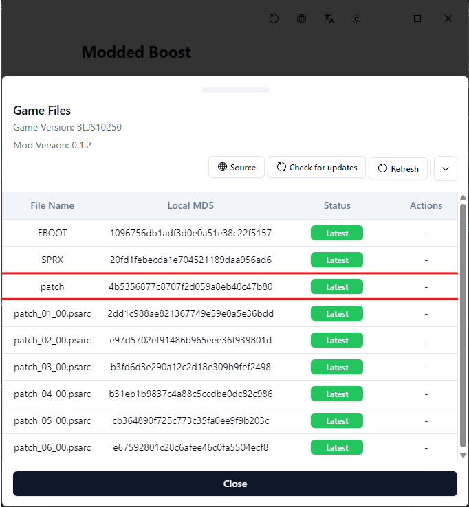
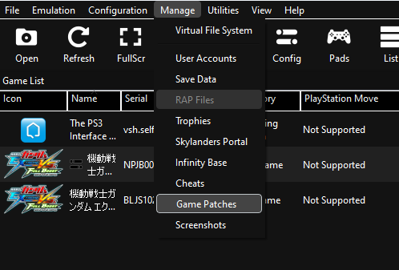
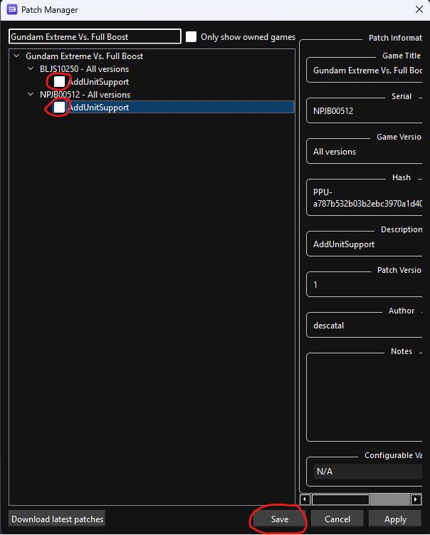

---
sidebar_label: Activate Patch
---

# Manual Patch Activation
Due to a limitation on the launcher to parse `patch_config.yml`, here is the manual way to activate the patch needed for the mod to work.

1. In your launcher, make sure the `patch` file is on the latest version. If not, please press the update button and wait for the process to finish.

    

2. Open the `Game Patches` menu in your RPCS3

    

3. In the search bar, type in `Gundam Extreme Vs. Full Boost`

   

4. Enable `AddUnitSupport` option for both game versions, and press the `save` button

   

5. Once that's done, your patch should be activated. The launcher will still show a `Not Activated` status, but please just ignore that.